# springboot-learning-demo
首先声明，Spring Boot不是一门新技术，所以不用紧张。从本质上来说，Spring Boot就是Spring,它做了那些没有它你也会去做的Spring Bean配置。它使用“习惯优于配置”（项目中存在大量的配置，此外还内置了一个习惯性的配置，让你无需手动进行配置）的理念让你的项目快速运行起来。使用Spring Boot很容易创建一个独立运行（运行jar,内嵌Servlet容器）、准生产级别的基于Spring框架的项目，使用Spring Boot你可以不用或者只需要很少的Spring配置。

## Spring Boot精要
Spring将很多魔法带入了Spring应用程序的开发之中，其中最重要的是以下四个核心。
* 自动配置：针对很多Spring应用程序常见的应用功能，Spring Boot能自动提供相关配置
* 起步依赖：告诉Spring Boot需要什么功能，它就能引入需要的库。
* 命令行界面：这是Spring Boot的可选特性，借此你只需写代码就能完成完整的应用程序，无需传统项目构建。
* Actuator：让你能够深入运行中的Spring Boot应用程序，一探究竟。

详细的我们就不展开，等你爱上后自然会去深入的了解，后续章节我们会一一展开介绍。接下来让我们开搞吧。我已经迫不及待的要尝尝Spring Boot的味道了。

## 初始化Spring Boot项目
构建一个Sping Boot的Maven项目，强烈推荐Spring Initializr,它从本质上来说就是一个Web应用程序，它能为你生成Spring Boot项目结构。
Spring Initializr有几种用法：

* 通过Web界面使用
    1. 访问：http://start.spring.io/
    2. 选择构建工具Maven Project、Spring Boot版本1.5.1以及一些工程基本信息，可参考下图所示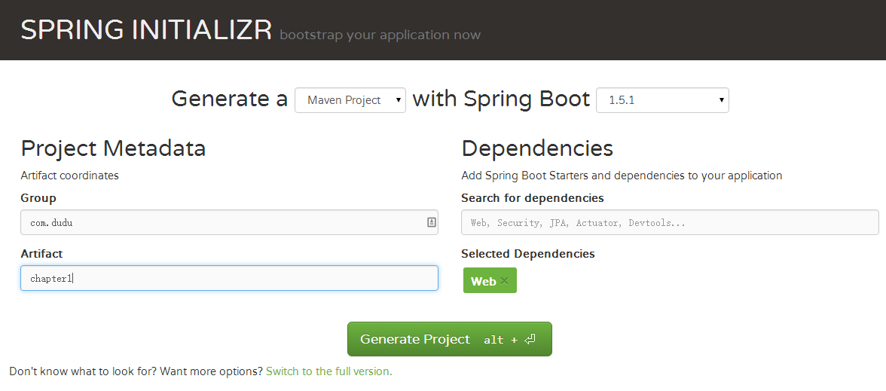
    3. 点击Generate Project下载项目压缩包
    4. 导入到你的工程，如果是IDEA，则需要：
        1. 菜单中选择File–>New–>Project from Existing Sources...
        2. 选择解压后的项目文件夹，点击OK
        3. 点击Import project from external model并选择Maven，点击Next到底为止。
        4. 若你的环境有多个版本的JDK，注意到选择Java SDK的时候请选择Java 7以上的版本
* 通过IntelliJ IDEA使用(个人推荐)
  IntelliJ IDEA是非常流行的IDE，IntelliJ IDEA 14.1已经支持Spring Boot了。
  创建Spring Boot操作步骤如下：
    1. 在File菜单里面选择 New > Project,然后选择Spring Initializr，接着如下图一步步操作即可。
    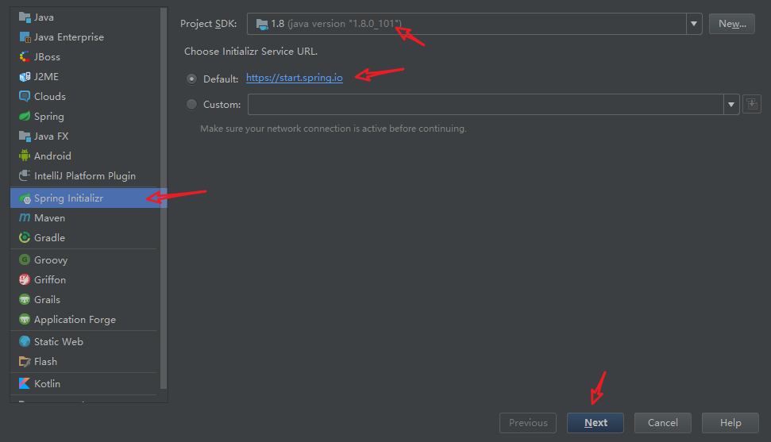
    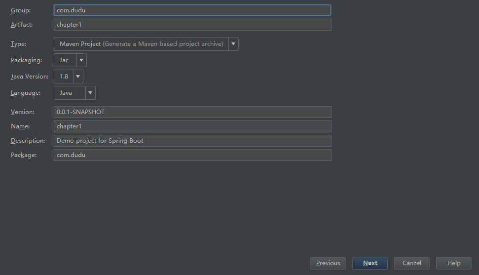
    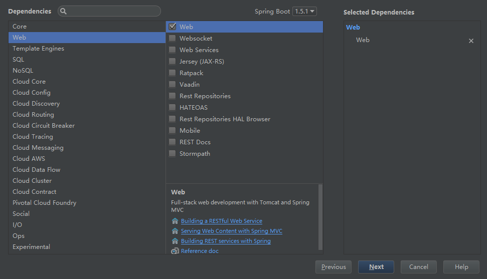
    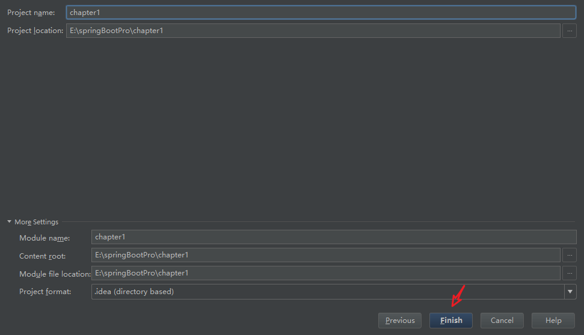

## 项目结构
根据上面的操作已经初始化了一个Spring Boot的框架了，项目结构如下：
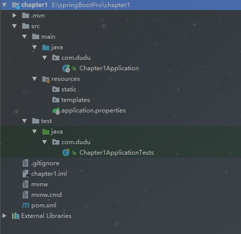
如你所见，项目里面基本没有代码，除了几个空目录外，还包含如下几样东西。
* pom.xml：Maven构建说明文件。
* Chapter1Application.java：一个带有main()方法的类，用于启动应用程序（关键）。
* Chapter1ApplicationTests.java：一个空的Junit测试类，它加载了一个使用Spring Boot字典配置功能的Spring应用程序上下文。
* application.properties：一个空的properties文件，你可以根据需要添加配置属性。

## 解析pom.xml
大家跟我一起移步pom.xml,看看Spring Boot的跟普通Spring MVC工程的Maven配置有啥不一样
```
<?xml version="1.0" encoding="UTF-8"?>
<project xmlns="http://maven.apache.org/POM/4.0.0" xmlns:xsi="http://www.w3.org/2001/XMLSchema-instance"
    xsi:schemaLocation="http://maven.apache.org/POM/4.0.0 http://maven.apache.org/xsd/maven-4.0.0.xsd">
    <modelVersion>4.0.0</modelVersion>

    <groupId>com.dudu</groupId>
    <artifactId>chapter1</artifactId>
    <version>0.0.1-SNAPSHOT</version>
    <packaging>jar</packaging>

    <name>chapter1</name>
    <description>Demo project for Spring Boot</description>

    <parent>
        <groupId>org.springframework.boot</groupId>
        <artifactId>spring-boot-starter-parent</artifactId>
        <version>1.5.1.RELEASE</version>
        <relativePath/> <!-- lookup parent from repository -->
    </parent>

    <properties>
        <project.build.sourceEncoding>UTF-8</project.build.sourceEncoding>
        <project.reporting.outputEncoding>UTF-8</project.reporting.outputEncoding>
        <java.version>1.8</java.version>
    </properties>

    <dependencies>
        <dependency>
            <groupId>org.springframework.boot</groupId>
            <artifactId>spring-boot-starter-web</artifactId>
        </dependency>

        <dependency>
            <groupId>org.springframework.boot</groupId>
            <artifactId>spring-boot-starter-test</artifactId>
            <scope>test</scope>
        </dependency>
    </dependencies>

    <build>
        <plugins>
            <plugin>
                <groupId>org.springframework.boot</groupId>
                <artifactId>spring-boot-maven-plugin</artifactId>
            </plugin>
        </plugins>
    </build>
</project>
```

### Spring Boot父级依赖
```
<parent>
    <groupId>org.springframework.boot</groupId>
    <artifactId>spring-boot-starter-parent</artifactId>
    <version>1.5.1.RELEASE</version>
    <relativePath/> <!-- lookup parent from repository -->
</parent>
```
这块配置就是Spring Boot父级依赖，有了这个，当前的项目就是Spring Boot项目了，spring-boot-starter-parent是一个特殊的starter,它用来提供相关的Maven默认依赖，使用它之后，常用的包依赖可以省去version标签。关于Spring Boot提供了哪些jar包的依赖，可查看C:\Users\用户.m2\repository\org\springframework\boot\spring-boot-dependencies\1.5.1.RELEASE\spring-boot-dependencies-1.5.1.RELEASE.pom
这里我就贴一点点意思意思，如下：
```
<properties>
        <!-- Dependency versions -->
        <activemq.version>5.14.3</activemq.version>
        <antlr2.version>2.7.7</antlr2.version>
        <appengine-sdk.version>1.9.48</appengine-sdk.version>
        <artemis.version>1.5.2</artemis.version>
        <aspectj.version>1.8.9</aspectj.version>
        <assertj.version>2.6.0</assertj.version>
        <atomikos.version>3.9.3</atomikos.version>
        <bitronix.version>2.1.4</bitronix.version>
        <caffeine.version>2.3.5</caffeine.version>
        <cassandra-driver.version>3.1.3</cassandra-driver.version>
        <classmate.version>1.3.3</classmate.version>
        <commons-beanutils.version>1.9.3</commons-beanutils.version>
        <commons-collections.version>3.2.2</commons-collections.version>
        <spring-data-releasetrain.version>Ingalls-RELEASE</spring-data-releasetrain.version>
        ......
</properties>
```
如果你不想使用某个依赖默认的版本，您还可以通过覆盖自己的项目中的属性来覆盖各个依赖项，例如，要升级到另一个Spring Data版本系列，您可以将以下内容添加到pom.xml中。
```
<properties>
    <spring-data-releasetrain.version>Fowler-SR2</spring-data-releasetrain.version>
</properties>
```
原本默认版本是Ingalls-RELEASE的（看上面最后一行有说明Ingalls-RELEASE），现在就使用Fowler-SR2版本了，简单吧。

并不是每个人都喜欢继承自spring-boot-starter-parent POM。您可能有您需要使用的自己的公司标准parent，或者您可能更喜欢显式声明所有的Maven配置。
如果你不想使用spring-boot-starter-parent，您仍然可以通过使用scope = import依赖关系来保持依赖关系管理：
```
<dependencyManagement>
     <dependencies>
        <dependency>
            <!-- Import dependency management from Spring Boot -->
            <groupId>org.springframework.boot</groupId>
            <artifactId>spring-boot-dependencies</artifactId>
            <version>1.5.1.RELEASE</version>
            <type>pom</type>
            <scope>import</scope>
        </dependency>
    </dependencies>
</dependencyManagement>
```
该设置不允许您使用如上所述的属性(properties)覆盖各个依赖项，要实现相同的结果，您需要在spring-boot-dependencies项之前的项目的dependencyManagement中添加一个配置，例如，要升级到另一个Spring Data版本系列，您可以将以下内容添加到pom.xml中。
```
<dependencyManagement>
    <dependencies>
        <!-- Override Spring Data release train provided by Spring Boot -->
        <dependency>
            <groupId>org.springframework.data</groupId>
            <artifactId>spring-data-releasetrain</artifactId>
            <version>Fowler-SR2</version>
            <scope>import</scope>
            <type>pom</type>
        </dependency>
        <dependency>
            <groupId>org.springframework.boot</groupId>
            <artifactId>spring-boot-dependencies</artifactId>
            <version>1.5.1.RELEASE</version>
            <type>pom</type>
            <scope>import</scope>
        </dependency>
    </dependencies>
</dependencyManagement>
```
### 起步依赖 spring-boot-starter-xx
Spring Boot提供了很多”开箱即用“的依赖模块，都是以spring-boot-starter-xx作为命名的。举个例子来说明一下这个起步依赖的好处，比如组装台式机和品牌机，自己组装的话需要自己去选择不同的零件，最后还要组装起来，期间有可能会遇到零件不匹配的问题。耗时又消力，而品牌机就好一点，买来就能直接用的，后续想换零件也是可以的。相比较之下，后者带来的效果更好点（这里就不讨论价格问题哈），起步依赖就像这里的品牌机，自动给你封装好了你想要实现的功能的依赖。就比如我们之前要实现web功能，引入了spring-boot-starter-web这个起步依赖。我们来看看spring-boot-starter-web到底依赖了哪些,如下图：
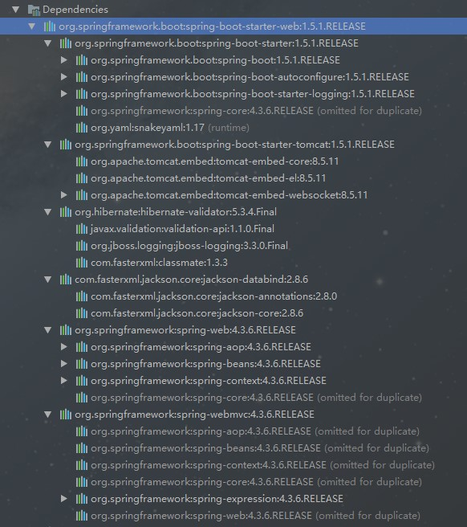
嘿嘿嘿，看来依赖了好多呢，如果让我自己弄估计要调半天，所以Spring Boot通过提供众多起步依赖降低项目依赖的复杂度。起步依赖本质上是一个Maven项目对象模型（Project Object Model，POM），定义了对其他库的传递依赖，这些东西加在一起即支持某项功能。很多起步依赖的命名都暗示了它们提供的某种或者某类功能。

### Spring Boot Maven插件
```
<build>
    <plugins>
        <plugin>
            <groupId>org.springframework.boot</groupId>
            <artifactId>spring-boot-maven-plugin</artifactId>
        </plugin>
    </plugins>
</build>
```
上面的配置就是Spring Boot Maven插件，Spring Boot Maven插件提供了许多方便的功能：
* 把项目打包成一个可执行的超级JAR（uber-JAR）,包括把应用程序的所有依赖打入JAR文件内，并为JAR添加一个描述文件，其中的内容能让你用java -jar来运行应用程序。
* 搜索public static void main()方法来标记为可运行类。

## 应用入口类
Chapter1Application是一个很关键的启动类，程序的入口就是这里,为了演示简单，我们不再新建控制类，而是直接在这个入口类中编写，添加@RestController以及index方法，如下：
```
package com.dudu;

import org.springframework.boot.SpringApplication;
import org.springframework.boot.autoconfigure.SpringBootApplication;
import org.springframework.web.bind.annotation.RequestMapping;
import org.springframework.web.bind.annotation.RestController;

@RestController
@SpringBootApplication
public class Chapter1Application {

	@RequestMapping("/")
	public String index(){
		return "Hello Spring Boot";
	}
	public static void main(String[] args) {
		SpringApplication.run(Chapter1Application.class, args);
	}
}
```
1. @SpringBootApplication是Sprnig Boot项目的核心注解，主要目的是开启自动配置。后续讲解原理的时候再深入介绍。
2. main方法这是一个标准的Java应用的main的方法，主要作用是作为项目启动的入口。
3. @RestController注解等价于@Controller+@ResponseBody的结合，使用这个注解的类里面的方法都以json格式输出。

最后，启动项目有三种方式：
* Chapter1Application的main方法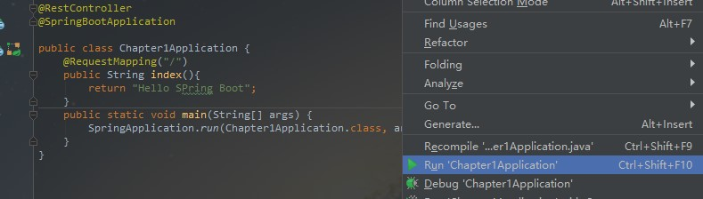
* 使用命令 mvn spring-boot:run”在命令行启动该应用，IDEA中该命令在如下位置：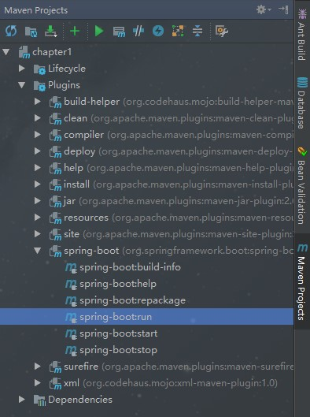
* 运行“mvn package”进行打包时，会打包成一个可以直接运行的 JAR 文件，使用“java -jar”命令就可以直接运行。
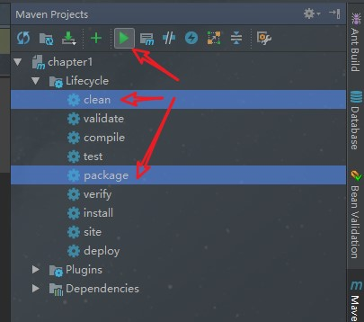
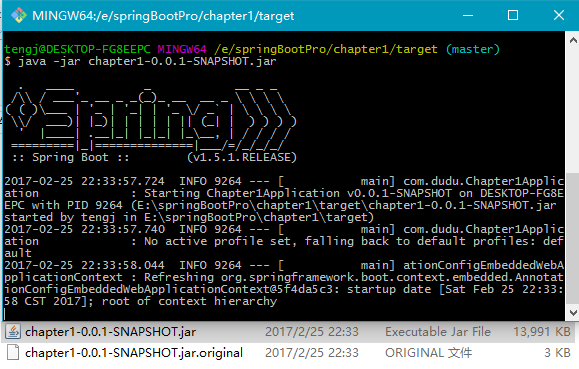

打开浏览器访问http://localhost:8080, 你就能看到页面显示Hello Spring Boot效果了，一个简单的Web的项目就是如此简单。

# Springboot启动原理解析
我们开发任何一个Spring Boot项目，都会用到如下的启动类
```
@SpringBootApplication
public class Application {
    public static void main(String[] args) {
        SpringApplication.run(Application.class, args);
    }
}
```
从上面代码可以看出，Annotation定义（@SpringBootApplication）和类定义（SpringApplication.run）最为耀眼，所以要揭开SpringBoot的神秘面纱，我们要从这两位开始就可以了。

## SpringBootApplication背后的秘密
```
@Target(ElementType.TYPE)
@Retention(RetentionPolicy.RUNTIME)
@Documented
@Inherited
@SpringBootConfiguration
@EnableAutoConfiguration
@ComponentScan(excludeFilters = {
        @Filter(type = FilterType.CUSTOM, classes = TypeExcludeFilter.class),
        @Filter(type = FilterType.CUSTOM, classes = AutoConfigurationExcludeFilter.class) })
public @interface SpringBootApplication {
...
}
```
虽然定义使用了多个Annotation进行了原信息标注，但实际上重要的只有三个Annotation：
* @Configuration（@SpringBootConfiguration点开查看发现里面还是应用了@Configuration）
* @EnableAutoConfiguration
* @ComponentScan

所以，如果我们使用如下的SpringBoot启动类，整个SpringBoot应用依然可以与之前的启动类功能对等：
```
@Configuration
@EnableAutoConfiguration
@ComponentScan
public class Application {
    public static void main(String[] args) {
        SpringApplication.run(Application.class, args);
    }
}
```
每次写这3个比较累，所以写一个@SpringBootApplication方便点。接下来分别介绍这3个Annotation。

## @Configuration
这里的@Configuration对我们来说不陌生，它就是JavaConfig形式的Spring Ioc容器的配置类使用的那个@Configuration，SpringBoot社区推荐使用基于JavaConfig的配置形式，所以，这里的启动类标注了@Configuration之后，本身其实也是一个IoC容器的配置类。
举几个简单例子回顾下，XML跟config配置方式的区别：
* 表达形式层面

基于XML配置的方式是这样：
```
<?xml version="1.0" encoding="UTF-8"?>
<beans xmlns="http://www.springframework.org/schema/beans"
       xmlns:xsi="http://www.w3.org/2001/XMLSchema-instance"
       xsi:schemaLocation="http://www.springframework.org/schema/beans http://www.springframework.org/schema/beans/spring-beans-3.0.xsd"
       default-lazy-init="true">
    <!--bean定义-->
</beans>
```
而基于JavaConfig的配置方式是这样：
```
@Configuration
public class MockConfiguration{
    //bean定义
}
```
任何一个标注了@Configuration的Java类定义都是一个JavaConfig配置类。

* 注册bean定义层面

基于XML的配置形式是这样：
```
<bean id="mockService" class="..MockServiceImpl">
    ...
</bean>
```
而基于JavaConfig的配置形式是这样的：
```
@Configuration
   public class MockConfiguration{
       @Bean
       public MockService mockService(){
           return new MockServiceImpl();
       }
   }
```
任何一个标注了@Bean的方法，其返回值将作为一个bean定义注册到Spring的IoC容器，方法名将默认成该bean定义的id。

* 表达依赖注入关系层面

为了表达bean与bean之间的依赖关系，在XML形式中一般是这样：
```
<bean id="mockService" class="..MockServiceImpl">
    <propery name ="dependencyService" ref="dependencyService" />
</bean>

<bean id="dependencyService" class="DependencyServiceImpl"></bean>
```
而基于JavaConfig的配置形式是这样的：
```
@Configuration
public class MockConfiguration{
    @Bean
    public MockService mockService(){
        return new MockServiceImpl(dependencyService());
    }
    
    @Bean
    public DependencyService dependencyService(){
        return new DependencyServiceImpl();
    }
}
```
如果一个bean的定义依赖其他bean,则直接调用对应的JavaConfig类中依赖bean的创建方法就可以了。

## @ComponentScan
@ComponentScan这个注解在Spring中很重要，它对应XML配置中的元素，@ComponentScan的功能其实就是自动扫描并加载符合条件的组件（比如@Component和@Repository等）或者bean定义，最终将这些bean定义加载到IoC容器中。

我们可以通过basePackages等属性来细粒度的定制@ComponentScan自动扫描的范围，如果不指定，则默认Spring框架实现会从声明@ComponentScan所在类的package进行扫描。

> 注：所以SpringBoot的启动类最好是放在root package下，因为默认不指定basePackages。

## @EnableAutoConfiguration
个人感觉@EnableAutoConfiguration这个Annotation最为重要，所以放在最后来解读，大家是否还记得Spring框架提供的各种名字为@Enable开头的Annotation定义？比如@EnableScheduling、@EnableCaching、@EnableMBeanExport等，@EnableAutoConfiguration的理念和做事方式其实一脉相承，简单概括一下就是，借助@Import的支持，收集和注册特定场景相关的bean定义。
* @EnableScheduling是通过@Import将Spring调度框架相关的bean定义都加载到IoC容器。
* @EnableMBeanExport是通过@Import将JMX相关的bean定义加载到IoC容器。

而@EnableAutoConfiguration也是借助@Import的帮助，将所有符合自动配置条件的bean定义加载到IoC容器，仅此而已！

@EnableAutoConfiguration作为一个复合Annotation,其自身定义关键信息如下：
```
@SuppressWarnings("deprecation")
@Target(ElementType.TYPE)
@Retention(RetentionPolicy.RUNTIME)
@Documented
@Inherited
@AutoConfigurationPackage
@Import(EnableAutoConfigurationImportSelector.class)
public @interface EnableAutoConfiguration {
    ...
}
```
其中，最关键的要属@Import(EnableAutoConfigurationImportSelector.class)，借助EnableAutoConfigurationImportSelector，@EnableAutoConfiguration可以帮助SpringBoot应用将所有符合条件的@Configuration配置都加载到当前SpringBoot创建并使用的IoC容器。就像一只“八爪鱼”一样

借助于Spring框架原有的一个工具类：SpringFactoriesLoader的支持，@EnableAutoConfiguration可以智能的自动配置功效才得以大功告成！
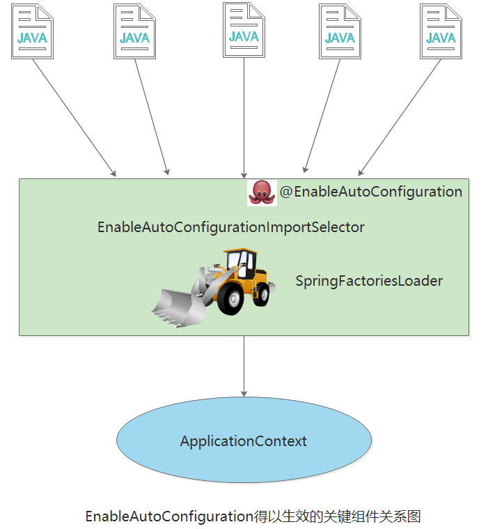

自动配置幕后英雄：SpringFactoriesLoader详解

SpringFactoriesLoader属于Spring框架私有的一种扩展方案，其主要功能就是从指定的配置文件META-INF/spring.factories加载配置。
```
public abstract class SpringFactoriesLoader {
    //...
    public static <T> List<T> loadFactories(Class<T> factoryClass, ClassLoader classLoader) {
        ...
    }


    public static List<String> loadFactoryNames(Class<?> factoryClass, ClassLoader classLoader) {
        ....
    }
}
```
配合@EnableAutoConfiguration使用的话，它更多是提供一种配置查找的功能支持，即根据@EnableAutoConfiguration的完整类名org.springframework.boot.autoconfigure.EnableAutoConfiguration作为查找的Key,获取对应的一组@Configuration类
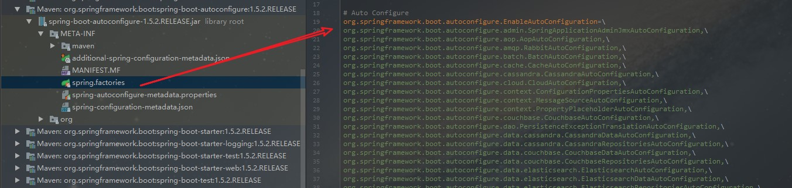
上图就是从SpringBoot的autoconfigure依赖包中的META-INF/spring.factories配置文件中摘录的一段内容，可以很好地说明问题。

所以，@EnableAutoConfiguration自动配置的魔法骑士就变成了：从classpath中搜寻所有的META-INF/spring.factories配置文件，并将其中org.springframework.boot.autoconfigure.EnableutoConfiguration对应的配置项通过反射（Java Refletion）实例化为对应的标注了@Configuration的JavaConfig形式的IoC容器配置类，然后汇总为一个并加载到IoC容器。

## 深入探索SpringApplication执行流程
SpringApplication的run方法的实现是我们本次旅程的主要线路，该方法的主要流程大体可以归纳如下：
1. 如果我们使用的是SpringApplication的静态run方法，那么，这个方法里面首先要创建一个SpringApplication对象实例，然后调用这个创建好的SpringApplication的实例方法。在SpringApplication实例初始化的时候，它会提前做几件事情：
    * 根据classpath里面是否存在某个特征类（org.springframework.web.context.ConfigurableWebApplicationContext）来决定是否应该创建一个为Web应用使用的ApplicationContext类型。
    * 使用SpringFactoriesLoader在应用的classpath中查找并加载所有可用的ApplicationContextInitializer。
    * 使用SpringFactoriesLoader在应用的classpath中查找并加载所有可用的ApplicationListener。
    * 推断并设置main方法的定义类。
2. SpringApplication实例初始化完成并且完成设置后，就开始执行run方法的逻辑了，方法执行伊始，首先遍历执行所有通过SpringFactoriesLoader可以查找到并加载的SpringApplicationRunListener。调用它们的started()方法，告诉这些SpringApplicationRunListener，“嘿，SpringBoot应用要开始执行咯！”。
3. 创建并配置当前Spring Boot应用将要使用的Environment（包括配置要使用的PropertySource以及Profile）。
4. 遍历调用所有SpringApplicationRunListener的environmentPrepared()的方法，告诉他们：“当前SpringBoot应用使用的Environment准备好了咯！”。
5. 如果SpringApplication的showBanner属性被设置为true，则打印banner。
6. 根据用户是否明确设置了applicationContextClass类型以及初始化阶段的推断结果，决定该为当前SpringBoot应用创建什么类型的ApplicationContext并创建完成，然后根据条件决定是否添加ShutdownHook，决定是否使用自定义的BeanNameGenerator，决定是否使用自定义的ResourceLoader，当然，最重要的，将之前准备好的Environment设置给创建好的ApplicationContext使用。
7. ApplicationContext创建好之后，SpringApplication会再次借助Spring-FactoriesLoader，查找并加载classpath中所有可用的ApplicationContext-Initializer，然后遍历调用这些ApplicationContextInitializer的initialize（applicationContext）方法来对已经创建好的ApplicationContext进行进一步的处理。
8. 遍历调用所有SpringApplicationRunListener的contextPrepared()方法。
9. 最核心的一步，将之前通过@EnableAutoConfiguration获取的所有配置以及其他形式的IoC容器配置加载到已经准备完毕的ApplicationContext。
10. 遍历调用所有SpringApplicationRunListener的contextLoaded()方法。
11. 调用ApplicationContext的refresh()方法，完成IoC容器可用的最后一道工序。
12. 查找当前ApplicationContext中是否注册有CommandLineRunner，如果有，则遍历执行它们。
13. 正常情况下，遍历执行SpringApplicationRunListener的finished()方法、（如果整个过程出现异常，则依然调用所有SpringApplicationRunListener的finished()方法，只不过这种情况下会将异常信息一并传入处理）
去除事件通知点后，整个流程如下：

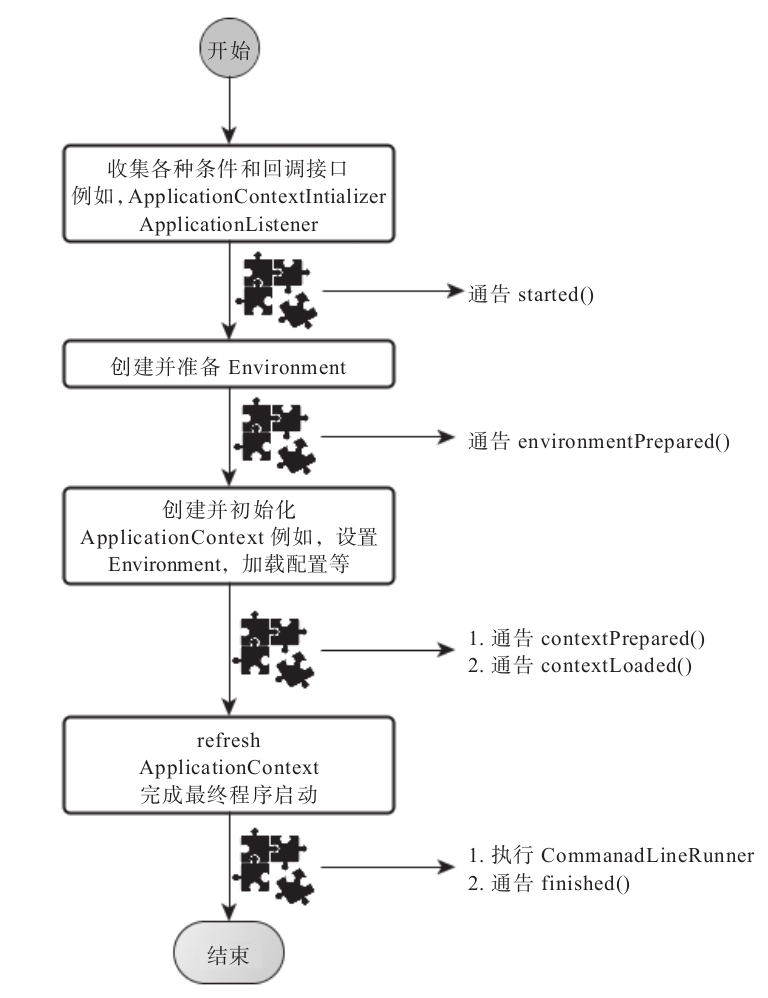

# 参考
[Spring Boot干货系列总纲](http://tengj.top/2017/04/24/springboot0/)<br/>
[spring-boot-examples](https://github.com/ityouknow/spring-boot-examples)<br/>
[springboot-learning-example](https://github.com/JeffLi1993/springboot-learning-example)<br/>
[SpringBoot-Learning](https://git.oschina.net/didispace/SpringBoot-Learning)<br/>
