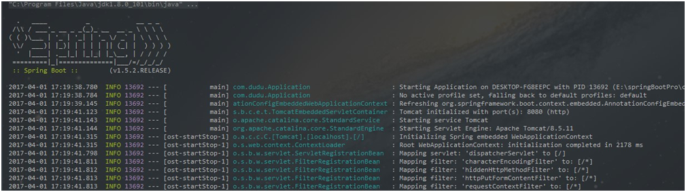

# springboot-log
Spring Boot在所有内部日志中使用Commons Logging，但是默认配置也提供了对常用日志的支持，如：Java Util Logging，Log4J,Log4J2和Logback。每种Logger都可以通过配置使用控制台或者文件输出日志内容。

## 默认日志Logback
SLF4J——Simple Logging Facade For Java，它是一个针对于各类Java日志框架的统一Facade抽象。Java日志框架众多——常用的有java.util.logging,log4j, logback，commons-logging, Spring框架使用的是Jakarta Commons Logging API (JCL)。而SLF4J定义了统一的日志抽象接口，而真正的日志实现则是在运行时决定的——它提供了各类日志框架的binding。

Logback是log4j框架的作者开发的新一代日志框架，它效率更高、能够适应诸多的运行环境，同时天然支持SLF4J。

默认情况下，Spring Boot会用Logback来记录日志，并用INFO级别输出到控制台。在运行应用程序和其他例子时，你应该已经看到很多INFO级别的日志了。

从上图可以看到，日志输出内容元素具体如下：
* 时间日期：精确到毫秒
* 日志级别：ERROR, WARN, INFO, DEBUG or TRACE
* 进程ID
* 分隔符：--- 标识实际日志的开始
* 线程名：方括号括起来（可能会截断控制台输出）
* Logger名：通常使用源代码的类名
* 日志内容

### 添加日志依赖
假如maven依赖中添加了spring-boot-starter-logging：
```
<dependency>
    <groupId>org.springframework.boot</groupId>
    <artifactId>spring-boot-starter-logging</artifactId>
</dependency>
```
那么，我们的Spring Boot应用将自动使用logback作为应用日志框架，Spring Boot启动的时候，由org.springframework.boot.logging.Logging-Application-Listener根据情况初始化并使用。

但是呢，实际开发中我们不需要直接添加该依赖，你会发现spring-boot-starter其中包含了 spring-boot-starter-logging，该依赖内容就是 Spring Boot 默认的日志框架 logback。而spring-boot-starter-web中包含spring-boot-starter-logging，不需要重复引用。
```
dependency>
    <groupId>org.springframework.boot</groupId>
    <artifactId>spring-boot-starter-web</artifactId>
</dependency>
```

### 默认配置属性支持
Spring Boot为我们提供了很多默认的日志配置，所以，只要将spring-boot-starter-logging作为依赖加入到当前应用的classpath，则“开箱即用”。
下面介绍几种在application.properties就可以配置的日志相关属性。

### 控制台输出
日志级别从低到高分为TRACE < DEBUG < INFO < WARN < ERROR < FATAL，如果设置为WARN，则低于WARN的信息都不会输出。
Spring Boot中默认配置ERROR、WARN和INFO级别的日志输出到控制台。您还可以通过启动您的应用程序–debug标志来启用“调试”模式（开发的时候推荐开启）,以下两种方式皆可：
* 在运行命令后加入--debug标志，如：$ java -jar springTest.jar --debug
* 在application.properties中配置debug=true，该属性置为true的时候，核心Logger（包含嵌入式容器、hibernate、spring）会输出更多内容，但是你自己应用的日志并不会输出为DEBUG级别。

### 文件输出
默认情况下，Spring Boot将日志输出到控制台，不会写到日志文件。如果要编写除控制台输出之外的日志文件，则需在application.properties中设置logging.file或logging.path属性。
* logging.file，设置文件，可以是绝对路径，也可以是相对路径。如：logging.file=my.log
* logging.path，设置目录，会在该目录下创建spring.log文件，并写入日志内容，如：logging.path=/var/log

如果只配置 logging.file，会在项目的当前路径下生成一个 xxx.log 日志文件。
如果只配置 logging.path，在 /var/log文件夹生成一个日志文件为 spring.log
> 注：二者不能同时使用，如若同时使用，则只有logging.file生效

默认情况下，日志文件的大小达到10MB时会切分一次，产生新的日志文件，默认级别为：ERROR、WARN、INFO

### 级别控制
所有支持的日志记录系统都可以在Spring环境中设置记录级别（例如在application.properties中）
格式为：’logging.level.* = LEVEL’
* logging.level：日志级别控制前缀，*为包名或Logger名
* LEVEL：选项TRACE, DEBUG, INFO, WARN, ERROR, FATAL, OFF

举例：
* logging.level.com.dudu=DEBUG：com.dudu包下所有class以DEBUG级别输出
* logging.level.root=WARN：root日志以WARN级别输出

### 自定义日志配置
由于日志服务一般都在ApplicationContext创建前就初始化了，它并不是必须通过Spring的配置文件控制。因此通过系统属性和传统的Spring Boot外部配置文件依然可以很好的支持日志控制和管理。
根据不同的日志系统，你可以按如下规则组织配置文件名，就能被正确加载：
* Logback：logback-spring.xml, logback-spring.groovy,logback.xml, logback.groovy
* Log4j：log4j-spring.properties, log4j-spring.xml,log4j.properties, log4j.xml
* Log4j2：log4j2-spring.xml, log4j2.xml
* JDK (Java Util Logging)：logging.properties

Spring Boot官方推荐优先使用带有-spring的文件名作为你的日志配置（如使用logback-spring.xml，而不是logback.xml），命名为logback-spring.xml的日志配置文件，spring boot可以为它添加一些spring boot特有的配置项（下面会提到）。

上面是默认的命名规则，并且放在src/main/resources下面即可。

如果你即想完全掌控日志配置，但又不想用logback.xml作为Logback配置的名字，可以通过logging.config属性指定自定义的名字：
```
logging.config=classpath:logging-config.xml
```
虽然一般并不需要改变配置文件的名字，但是如果你想针对不同运行时Profile使用不同的日志配置，这个功能会很有用。
下面我们来看看一个普通的logback-spring.xml例子
```
<?xml version="1.0" encoding="UTF-8"?>
<configuration  scan="true" scanPeriod="60 seconds" debug="false">
    <contextName>logback</contextName>
    <property name="log.path" value="C:\\logs\\demo\\logback.log" />
    <!--输出到控制台-->
    <appender name="console" class="ch.qos.logback.core.ConsoleAppender">
        <!-- <filter class="ch.qos.logback.classic.filter.ThresholdFilter">
             <level>ERROR</level>
         </filter>-->
        <encoder>
            <pattern>%d{HH:mm:ss.SSS} %contextName [%thread] %-5level %logger{36} - %msg%n</pattern>
        </encoder>
    </appender>

    <!--输出到文件-->
    <appender name="file" class="ch.qos.logback.core.rolling.RollingFileAppender">
        <file>${log.path}</file>
        <rollingPolicy class="ch.qos.logback.core.rolling.TimeBasedRollingPolicy">
            <fileNamePattern>logback.%d{yyyy-MM-dd}.log</fileNamePattern>
        </rollingPolicy>
        <encoder>
            <pattern>%d{HH:mm:ss.SSS} %contextName [%thread] %-5level %logger{36} - %msg%n</pattern>
        </encoder>
    </appender>

    <root level="info">
        <appender-ref ref="console" />
        <appender-ref ref="file" />
    </root>

    <!-- logback为java中的包 -->
    <logger name="com.louie.learning.springboot.controller"/>
    <!--logback.LogbackDemo：类的全路径 -->
    <logger name="com.louie.learning.springboot.controller.HelloController" level="WARN" additivity="false">
        <appender-ref ref="console"/>
    </logger>
</configuration>
```

#### 根节点<configuration>包含的属性
* scan:当此属性设置为true时，配置文件如果发生改变，将会被重新加载，默认值为true。
* scanPeriod:设置监测配置文件是否有修改的时间间隔，如果没有给出时间单位，默认单位是毫秒。当scan为true时，此属性生效。默认的时间间隔为1分钟。
* debug:当此属性设置为true时，将打印出logback内部日志信息，实时查看logback运行状态。默认值为false。

根节点<configuration>的子节点：
<configuration>下面一共有2个属性，3个子节点，分别是：

#### 属性一：设置上下文名称<contextName>
每个logger都关联到logger上下文，默认上下文名称为“default”。但可以使用设置成其他名字，用于区分不同应用程序的记录。一旦设置，不能修改,可以通过%contextName来打印日志上下文名称。
```
<contextName>logback</contextName>
```

#### 属性二：设置变量<property>
用来定义变量值的标签， 有两个属性，name和value；其中name的值是变量的名称，value的值时变量定义的值。通过定义的值会被插入到logger上下文中。定义变量后，可以使“${}”来使用变量。
```
<property name="log.path" value="E:\\logback.log" />
```

#### 子节点一<appender>
appender用来格式化日志输出节点，有俩个属性name和class，class用来指定哪种输出策略，常用就是控制台输出策略和文件输出策略。

控制台输出ConsoleAppender：
```
<!--输出到控制台-->
<appender name="console" class="ch.qos.logback.core.ConsoleAppender">
    <filter class="ch.qos.logback.classic.filter.ThresholdFilter">
        <level>ERROR</level>
    </filter>
    <encoder>
        <pattern>%d{HH:mm:ss.SSS} %contextName [%thread] %-5level %logger{36} - %msg%n</pattern>
    </encoder>
</appender>
```
encoder标签表示对日志进行编码：
* %d{HH: mm:ss.SSS}——日志输出时间
* %thread——输出日志的进程名字，这在Web应用以及异步任务处理中很有用
* %-5level——日志级别，并且使用5个字符靠左对齐
* %logger{36}——日志输出者的名字
* %msg——日志消息
* %n——平台的换行符

ThresholdFilter为系统定义的拦截器，例如我们用ThresholdFilter来过滤掉ERROR级别以下的日志不输出到文件中。如果不用记得注释掉，不然你控制台会发现没日志~

#### 输出到文件RollingFileAppender
另一种常见的日志输出到文件，随着应用的运行时间越来越长，日志也会增长的越来越多，将他们输出到同一个文件并非一个好办法。RollingFileAppender用于切分文件日志：
```
<!--输出到文件-->
<appender name="file" class="ch.qos.logback.core.rolling.RollingFileAppender">
    <file>${log.path}</file>
    <rollingPolicy class="ch.qos.logback.core.rolling.TimeBasedRollingPolicy">
		<fileNamePattern>logback.%d{yyyy-MM-dd}.log</fileNamePattern>
        <maxHistory>30</maxHistory>
		<totalSizeCap>1GB</totalSizeCap>
    </rollingPolicy>
    <encoder>
        <pattern>%d{HH:mm:ss.SSS} %contextName [%thread] %-5level %logger{36} - %msg%n</pattern>
    </encoder>
</appender>
```
其中重要的是rollingPolicy的定义，上例中```<fileNamePattern>logback.%d{yyyy-MM-dd}.log</fileNamePattern>```定义了日志的切分方式——把每一天的日志归档到一个文件中，```<maxHistory>30</maxHistory>```表示只保留最近30天的日志，以防止日志填满整个磁盘空间。同理，可以使用%d{yyyy-MM-dd_HH-mm}来定义精确到分的日志切分方式。```<totalSizeCap>1GB</totalSizeCap>```用来指定日志文件的上限大小，例如设置为1GB的话，那么到了这个值，就会删除旧的日志。

#### 子节点二```<root>```
root节点是必选节点，用来指定最基础的日志输出级别，只有一个level属性。
* level:用来设置打印级别，大小写无关：TRACE, DEBUG, INFO, WARN, ERROR, ALL 和 OFF，不能设置为INHERITED或者同义词NULL。
默认是DEBUG。

可以包含零个或多个元素，标识这个appender将会添加到这个loger。
```
<root level="debug">
    <appender-ref ref="console" />
    <appender-ref ref="file" />
</root>
```

#### 子节点三```<loger>```
```<loger>```用来设置某一个包或者具体的某一个类的日志打印级别、以及指定```<appender>```。```<loger>```仅有一个name属性，一个可选的level和一个可选的addtivity属性。
* name:用来指定受此loger约束的某一个包或者具体的某一个类。
* level:用来设置打印级别，大小写无关：TRACE, DEBUG, INFO, WARN, ERROR, ALL 和 OFF，还有一个特俗值INHERITED或者同义词NULL，代表强制执行上级的级别。如果未设置此属性，那么当前loger将会继承上级的级别。
* addtivity:是否向上级loger传递打印信息。默认是true。

loger在实际使用的时候有两种情况
先来看一看代码中如何使用
```
package com.dudu.controller;
@Controller
public class LearnController {
    private Logger logger = LoggerFactory.getLogger(this.getClass());

    @RequestMapping(value = "/login",method = RequestMethod.POST)
    @ResponseBody
    public Map<String,Object> login(HttpServletRequest request, HttpServletResponse response){
        //日志级别从低到高分为TRACE < DEBUG < INFO < WARN < ERROR < FATAL，如果设置为WARN，则低于WARN的信息都不会输出。
        logger.trace("日志输出 trace");
        logger.debug("日志输出 debug");
        logger.info("日志输出 info");
        logger.warn("日志输出 warn");
        logger.error("日志输出 error");
        Map<String,Object> map =new HashMap<String,Object>();
        String userName=request.getParameter("userName");
        String password=request.getParameter("password");
        if(!userName.equals("") && password!=""){
            User user =new User(userName,password);
            request.getSession().setAttribute("user",user);
            map.put("result","1");
        }else{
            map.put("result","0");
        }
        return map;
    }
}
```
这是一个登录的判断的方法，我们引入日志，并且打印不同级别的日志，然后根据logback-spring.xml中的配置来看看打印了哪几种级别日志。

第一种：带有loger的配置，不指定级别，不指定appender
```
<logger name="com.dudu.controller"/>
```
```<logger name="com.dudu.controller" />```将控制controller包下的所有类的日志的打印，但是并没用设置打印级别，所以继承他的上级的日志级别“info”；
没有设置addtivity，默认为true，将此loger的打印信息向上级传递；
没有设置appender，此loger本身不打印任何信息。
```<root level="info">```将root的打印级别设置为“info”，指定了名字为“console”的appender。
当执行com.dudu.controller.LearnController类的login方法时，LearnController 在包com.dudu.controller中，所以首先执行```<logger name="com.dudu.controller"/>```，将级别为“info”及大于“info”的日志信息传递给root，本身并不打印；
root接到下级传递的信息，交给已经配置好的名为“console”的appender处理，“console”appender将信息打印到控制台；

打印结果如下：
```
16:00:17.407 logback [http-nio-8080-exec-8] INFO  com.dudu.controller.LearnController - 日志输出 info
16:00:17.408 logback [http-nio-8080-exec-8] WARN  com.dudu.controller.LearnController - 日志输出 warn
16:00:17.408 logback [http-nio-8080-exec-8] ERROR com.dudu.controller.LearnController - 日志输出 error
```
第二种：带有多个loger的配置，指定级别，指定appender
```
<!--logback.LogbackDemo：类的全路径 -->
<logger name="com.dudu.controller.LearnController" level="WARN" additivity="false">
    <appender-ref ref="console"/>
</logger>
```
控制com.dudu.controller.LearnController类的日志打印，打印级别为“WARN”;
additivity属性为false，表示此loger的打印信息不再向上级传递;
指定了名字为“console”的appender;
这时候执行com.dudu.controller.LearnController类的login方法时，先执行```<logger name="com.dudu.controller.LearnController" level="WARN" additivity="false">```,
将级别为“WARN”及大于“WARN”的日志信息交给此loger指定的名为“console”的appender处理，在控制台中打出日志，不再向上级root传递打印信息。
打印结果如下：
```
16:00:17.408 logback [http-nio-8080-exec-8] WARN  com.dudu.controller.LearnController - 日志输出 warn
16:00:17.408 logback [http-nio-8080-exec-8] ERROR com.dudu.controller.LearnController - 日志输出 error
```
当然如果你把additivity=”false”改成additivity=”true”的话，就会打印两次，因为打印信息向上级传递，logger本身打印一次，root接到后又打印一次。

### 多环境日志输出
据不同环境（prod:生产环境，test:测试环境，dev:开发环境）来定义不同的日志输出，在 logback-spring.xml中使用 springProfile 节点来定义，方法如下：
> 文件名称不是logback.xml，想使用spring扩展profile支持，要以logback-spring.xml命名

```
<!-- 测试环境+开发环境. 多个使用逗号隔开. -->
<springProfile name="test,dev">
    <logger name="com.dudu.controller" level="info" />
</springProfile>
<!-- 生产环境. -->
<springProfile name="prod">
    <logger name="com.dudu.controller" level="ERROR" />
</springProfile>
```
可以启动服务的时候指定 profile （如不指定使用默认），如指定prod 的方式为：
java -jar xxx.jar –spring.profiles.active=prod

## 改用Log4j2

### 修改pom.xml
```
<dependency>
       <groupId>org.springframework.boot</groupId>
       <artifactId>spring-boot-starter-web</artifactId>
       <exclusions>
           <!-- 想要配置log4j2，就要先去除logging包 -->
           <exclusion>
               <groupId>org.springframework.boot</groupId>
               <artifactId>spring-boot-starter-logging</artifactId>
           </exclusion>
       </exclusions>
   </dependency>
   <!-- 添加spring-boot-starter-log4j2的依赖包 -->
   <dependency>
       <groupId>org.springframework.boot</groupId>
       <artifactId>spring-boot-starter-log4j2</artifactId>
   </dependency>
```
### application.properties
```
logging.config=classpath:log4j2-spring.xml
```

### log4j2-spring.xml
```
<?xml version="1.0" encoding="UTF-8"?>
<!--status:指定log4j本身的打印日志的级别，优先级顺序：OFF>FATAL>ERROR>WARN>INFO>DEBUG>TRACE>ALL
monitorInterval:用于指定log4j自动重新配置的监测间隔时间。-->
<configuration status="WARN" monitorInterval="30">
    <Properties>
        <Property name="LOG_HOME">C:/logs/demo</Property>
        <Property name="PATTERN">%d{yyyy-MM-dd HH:mm:ss.SSS} [%t-%L] %-5level %logger{36} - %msg%n</Property>
    </Properties>
    <!--先定义所有的appender-->
    <Appenders>
        <!--这个输出控制台的配置-->
        <Console name="Console" target="SYSTEM_OUT">
            <!--控制台只输出level及以上级别的信息（onMatch），其他的直接拒绝（onMismatch）-->
            <ThresholdFilter level="trace" onMatch="ACCEPT" onMismatch="DENY"/>
            <!--输出日志的格式-->
            <!--
            %d{yyyy-MM-dd HH:mm:ss.SSS} 日志生产时间
            %p 日志输出格式
            %c logger的名称
            %m 日志内容，即logger.info("message")
            %n 换行符
            %C Java类名
            %L 日志输出所在行数
            %M 日志输出所在方法名
            hostName 本地机器名
            hostAddress 本地ip地址
            -->
            <PatternLayout pattern="${PATTERN}"/>
        </Console>

        <!--文件会打印出所有信息，这个log每次运行程序会自动清空，由append属性决定，这个也挺有用的，适合临时测试用-->
        <!--append为true表示消息增加到指定文件中，false表示消息覆盖指定的文件内容，默认值是true-->
        <File name="log" fileName="${LOG_HOME}/test.log" append="false">
            <PatternLayout pattern="%d{HH:mm:ss.SSS} %-5level %class{36} %L %M - %msg%xEx%n"/>
        </File>

        <!--这个会打印出所有的info及以下级别的信息，每次大小超过size,
        则这size大小的日志会自动存入按年份-月份建立的文件夹下面并进行压缩，作为存档-->
        <RollingFile name="RollingFileInfo" fileName="${LOG_HOME}/info.log"
                     filePattern="${LOG_HOME}/$${date:yyyy-MM}/info-%d{yyyy-MM-dd}-%i.log">
            <!--控制台只输出level及以上级别的信息（onMatch）,其他的直接拒绝（omMismatch）-->
            <ThresholdFilter level="info" onMatch="ACCEPT" onMismatch="DENY"/>
            <PatternLayout pattern="%d{yyyy-MM-dd HH:mm:ss.SSS} [%t] %-5level %logger{36} - %msg%n"/>
            <Policies>
                <!--基于时间的滚动策略，interval属性用来指定多久滚动一次，默认是1hour.
                modulate=true用来调整时间：比如现在是早上3am，interval是4，那么第一次滚动是在4am，接着是8am，12am...而不是7am. -->
                <!-- 关键点在于 filePattern后的日期格式，以及TimeBasedTriggeringPolicy的interval，
                日期格式精确到哪一位，interval也精确到哪一个单位 -->
                modulate-->
                <TimeBasedTriggeringPolicy modulate="true" interval="1"/>
                <!-- SizeBasedTriggeringPolicy:Policies子节点， 基于指定文件大小的滚动策略，size属性用来定义每个日志文件的大小. -->
                <!-- <SizeBasedTriggeringPolicy size="2 kB" />  -->
                <!--<SizeBasedTriggeringPolicy size="10 MB"/>-->
            </Policies>
        </RollingFile>

        <RollingFile name="RollingFileWarn" fileName="${LOG_HOME}/warn/warn.log"
                     filePattern="${LOG_HOME}/warn/$${date:yyyy-MM}/warn-%d{yyyy-MM-dd}-%i.log">
            <ThresholdFilter level="warn" onMatch="ACCEPT" onMismatch="DENY"/>
            <PatternLayout pattern="%d{yyyy-MM-dd HH:mm:ss.SSS} [%t] %-5level %logger{36} - %msg%n"/>
            <Policies>
                <TimeBasedTriggeringPolicy/>
                <SizeBasedTriggeringPolicy size="2 kB"/>
            </Policies>
            <!-- DefaultRolloverStrategy属性如不设置，则默认为最多同一文件夹下7个文件，这里设置了20 -->
            <DefaultRolloverStrategy max="20"/>
        </RollingFile>

        <RollingFile name="RollingFileError" fileName="${LOG_HOME}/error/error.log"
                     filePattern="${LOG_HOME}/error/$${date:yyyy-MM}/error-%d{yyyy-MM-dd-HH-mm}-%i.log">
            <ThresholdFilter level="error" onMatch="ACCEPT" onMismatch="DENY"/>
            <PatternLayout pattern="%d{yyyy-MM-dd HH:mm:ss.SSS} [%t] %-5level %logger{36} - %msg%n"/>
            <Policies>
                <!-- log4j2的按分钟 分日志文件 : warn-%d{yyyy-MM-dd-HH-mm}-%i.log-->
                <TimeBasedTriggeringPolicy interval="1" modulate="true"/>
                <!-- <SizeBasedTriggeringPolicy size="10 MB" /> -->
            </Policies>
        </RollingFile>

    </Appenders>

    <!--然后定义logger，只有定义了logger并引入的appender，appender才会生效-->
    <Loggers>
        <!--过滤掉spring和mybatis的一些无用的DEBUG信息-->
        <logger name="org.springframework" level="INFO"></logger>
        <!--<logger name="org.mybatis" level="INFO"></logger>-->

        <!-- 第三方日志系统 -->
        <logger name="org.springframework.core" level="info"/>
        <logger name="org.springframework.beans" level="info"/>
        <logger name="org.springframework.context" level="info"/>
        <logger name="org.springframework.web" level="info"/>
        <logger name="org.apache.http" level="warn"/>

        <!-- 配置日志的根节点 -->
        <root level="all">
            <appender-ref ref="Console"/>
            <!--<appender-ref ref="log"/>-->
            <appender-ref ref="RollingFileInfo"/>
            <appender-ref ref="RollingFileWarn"/>
            <appender-ref ref="RollingFileError"/>
        </root>
    </Loggers>
</configuration>
```

##总结
到此为止终于介绍完日志框架了，平时使用的时候推荐用自定义logback-spring.xml来配置，代码中使用日志也很简单，类里面添加
```
private Logger logger = LoggerFactory.getLogger(this.getClass());
```
即可。
