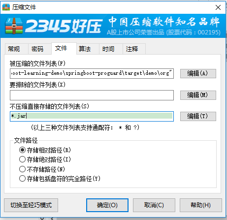

# springboot-proguard
使用proguard插件进行代码混淆

### pom.xml配置
```
            <!-- ProGuard混淆插件-->
            <plugin>
                <groupId>com.github.wvengen</groupId>
                <artifactId>proguard-maven-plugin</artifactId>
                <version>2.0.11</version>
                <executions>
                    <execution>
                        <!-- 混淆时刻，这里是打包的时候混淆-->
                        <phase>package</phase>
                        <goals>
                            <!-- 使用插件的什么功能，当然是混淆-->
                            <goal>proguard</goal>
                        </goals>
                    </execution>
                </executions>
                <configuration>
                    <!-- attach 的作用是在 install 与 deploy 时将生成的 pg 文件也安装与部署 -->
                    <!-- 是否将生成的PG文件安装部署-->
                    <!--<attach>true</attach>-->
                    <!-- 指定生成文件分类 -->
                    <!--<attachArtifactClassifier>pg</attachArtifactClassifier>-->

                    <options>
                        <!-- JDK目标版本1.7-->
                        <!--<option>-target 1.7</option>-->
                        <!-- 不做收缩（删除注释、未被引用代码）-->
                        <option>-dontshrink</option>
                        <!-- 不做优化（变更代码实现逻辑）-->
                        <option>-dontoptimize</option>
                        <!-- 不路过非公用类文件及成员-->
                        <option>-dontskipnonpubliclibraryclasses</option>
                        <option>-dontskipnonpubliclibraryclassmembers</option>
                        <!--<option>-dontnote</option>-->

                        <!-- 优化时允许访问并修改有修饰符的类和类的成员 -->
                        <option>-allowaccessmodification</option>
                        <!-- 确定统一的混淆类的成员名称来增加混淆-->
                        <option>-useuniqueclassmembernames</option>
                        <!-- 不混淆所有包名，本人测试混淆后WEB项目问题实在太多，毕竟Spring配置中有大量固定写法的包名-->
                        <option>-keeppackagenames</option>
                        <!-- 不混淆所有特殊的类-->
                        <option>-keepattributes
                            Exceptions,InnerClasses,Signature,Deprecated,SourceFile,LineNumberTable,LocalVariable*Table,*Annotation*,Synthetic,EnclosingMethod
                        </option>

                        <!-- 不混淆所有的set/get方法，毕竟项目中使用的部分第三方框架（例如Shiro）会用到大量的set/get映射-->
                        <option>-keepclassmembers public class * {void set*(***);*** get*();}</option>

                        <!--保持bean类名与属性名不变-->
                        <option>-keep class com.louie.learning.springboot.**.model.** {*;}</option>
                        <option>-keep class com.louie.learning.springboot.**.dao.** {*;}</option>

                        <!--保持类名不变-->
                        <option>-keep class com.louie.learning.springboot.**.service.**</option>
                        <option>-keep class com.louie.learning.springboot.**.controller.**</option>

                        <!--springboot相关的类全都不混淆-->
                        <option>-keep class com.louie.learning.springboot.SpringbootProguardApplication {*;}</option>

                        <!--以下配置第三方包不参与混淆-->
                        <option>-keepclassmembers class oracle.** { *;}</option>
                        <option>-dontwarn oracle.**</option>
                        <option>-keep class oracle.**</option>

                        <option>-keepclassmembers class org.aopalliance.** { *;}</option>
                        <option>-dontwarn org.aopalliance.**</option>
                        <option>-keep class org.aopalliance.**</option>

                        <option>-keepclassmembers class org.apache.commons.** { *;}</option>
                        <option>-dontwarn org.apache.commons.**</option>
                        <option>-keep class org.apache.commons.**</option>

                        <option>-keepclassmembers class org.apache.log4j.** { *;}</option>
                        <option>-dontwarn org.apache.log4j.**</option>
                        <option>-keep class org.apache.log4j.**</option>

                        <option>-keepclassmembers class org.slf4j.** { *;}</option>
                        <option>-dontwarn org.slf4j.**</option>
                        <option>-keep class org.slf4j.**</option>

                        <option>-keepclassmembers class org.springframework.** { *;}</option>
                        <option>-dontwarn org.springframework.**</option>
                        <option>-keep class org.springframework.**</option>
                    </options>

                    <!-- 是否混淆-->
                    <obfuscate>true</obfuscate>

                    <!-- 对什么东西进行加载，这里仅有classes成功，毕竟你也不可能对配置文件及JSP混淆吧-->
                    <injar>classes</injar>
                    <!--<outjar>${project.build.finalName}-pg.jar</outjar>-->
                    <outjar>${project.build.finalName}-pg</outjar>

                    <!-- 添加依赖，这里你可以按你的需要修改，这里测试只需要一个JRE的Runtime包就行了 -->
                    <libs>
                        <lib>${java.home}/lib/rt.jar</lib>
                        <lib>${java.home}/lib/jce.jar</lib>
                    </libs>
                    <!-- 加载文件的过滤器，就是你的工程目录了-->
                    <inFilter>com/louie/learning/springboot/**</inFilter>
                    <!-- 输出目录-->
                    <!--<outputDirectory>${project.build.directory}</outputDirectory>-->
                </configuration>
            </plugin>
```

# 使用说明
执行mvn package之后，混淆的代码并没有直接放入最终的demo.jar中，需要手动覆盖
1. 先解压demo.jar到demo文件夹
2. 复制demo-pg文件夹下的com文件夹，进入demo/BOOT-INF/classes文件夹，删除原有的com文件夹，然后将之前复制的com文件夹粘贴至此
3. 使用压缩工具将demo文件夹下的内容打包成压缩包，注意不能压缩jar文件，基本都在demo/BOOT-INF/lib下
4. 打包完成后修改后缀名为jar
> 